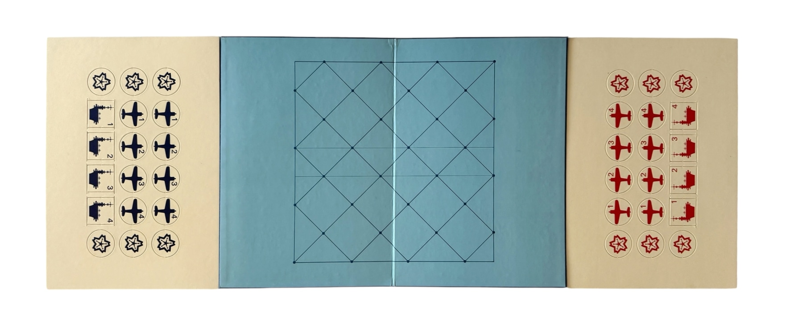
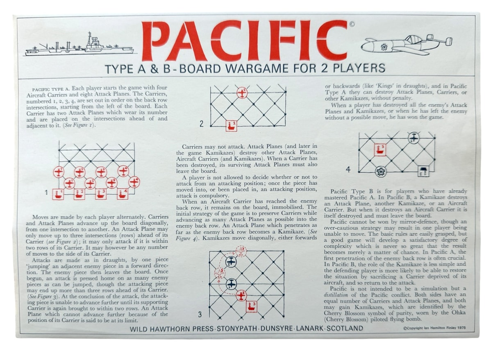
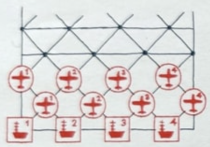
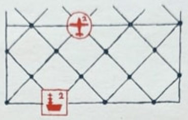
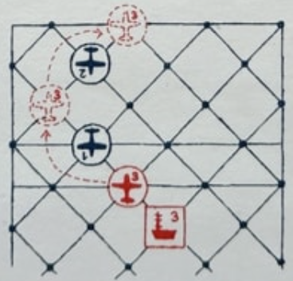
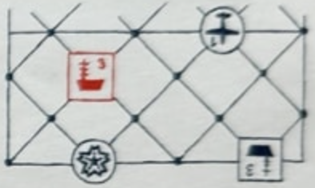

# Pacific Game Rules

## General

- Type A & B - Board Wargame for 2 Players.

## Original Game Materials

## Pacific Type A

### Board
The Pacific game board is a 7x7 grid of diagonal intersecting lines. The board is square, with intersections of the grid cells forming the playable spaces, such that the actual playable locations are 8 rows of 4 points. The back row for each player is the row closest to them, where their four Aircraft Carriers are initially placed. In even numbered rows, each point connects to the corresponding point in the neighboring rows, as well as the point ahead of it. In odd rows, points also connect to the points behind them in row-order. 

### Setup
- Each player starts the game with four Aircraft Carriers and eight Attack Planes.
- The Carriers, numbered 1, 2, 3, 4, are set out in order on the back row intersections, starting from the left of the board.
- Each Carrier has two Attack Planes which wear its number and are placed on the intersections ahead of it. (See Figure 1 in original rules).

### Gameplay
- Moves are made by each player alternately.

### Movement
- Carriers and Attack Planes advance up the board diagonally, from one intersection to another.
- An Attack Plane may only move up to three intersections (rows) ahead of its Carrier. (See Figure 2 in original rules).

  
- An Attack Plane may only attack if it is within two rows of its Carrier. It may however be any number of moves to the side of its Carrier.
- An Attack Plane which cannot advance further because of the position of its Carrier is said to be at its limit.

### Attack
- Carriers may not attack.
- Attack Planes (and later in the game Kamikazes) destroy other Attack Planes, Aircraft Carriers (and Kamikazes).
- When a Carrier has been destroyed, its surviving Attack Planes must also leave the board.
- A player is not allowed to decide whether or not to attack from an attacking position; once the piece has moved into, or been placed in, an attacking position, attack is compulsory.
- Attacks are made as in draughts, by one piece 'jumping' an adjacent enemy piece in a forward direction. The enemy piece then leaves the board.
- Once begun, an attack is pressed home on as many enemy pieces as can be jumped, though the attacking piece may end up more than three rows ahead of its Carrier. (See Figure 3 in original rules).

  
- At the conclusion of the attack, the attacking piece is unable to advance further until its supporting Carrier is again brought to within two rows.

### Kamikazes (Type A)
- When an Aircraft Carrier has reached the enemy back row, it remains on the board, immobilised.
- The initial strategy of the game is to preserve Carriers while advancing as many Attack Planes as possible into the enemy back row.
- An Attack Plane which penetrates as far as the enemy back row becomes a Kamikaze. (See Figure 4 in original rules).

  
- Kamikazes move diagonally, either forwards or backwards (like 'Kings' in draughts).
- In Pacific Type A, Kamikazes can destroy Attack Planes, Carriers, or other Kamikazes, without penalty.

### Winning the Game
- When a player has destroyed all the enemy's Attack Planes and Kamikazes, or when he has left the enemy without a possible move, he has won the game.

## Pacific Type B

- For players who have already mastered Pacific A.
- In Pacific B, a Kamikaze destroys an Attack Plane, another Kamikaze, or an Aircraft Carrier.
- When a Kamikaze destroys an Aircraft Carrier in Type B, it is itself destroyed and must leave the board.

## General Notes
- Pacific cannot be won by mirror-defence, though an over-cautious strategy may result in one player being unable to move.
- The basic rules are easily grasped, but a good game will develop a satisfactory degree of complexity which is never so great that the result becomes merely a matter of chance.
- In Pacific A, the first penetration of the enemy back row is often crucial.
- In Pacific B, the role of the Kamikaze is less simple and the defending player is more likely to be able to restore the situation by sacrificing a Carrier deprived of its aircraft, and so return to the attack.
- Pacific is not intended to be a simulation but a distillation of the Pacific conflict.
- Both sides have an equal number of Carriers and Attack Planes, and both may gain Kamikazes, which are identified by the Cherry Blossom symbol of purity, worn by the Ohka (Cherry Blossom) piloted flying bomb.

---
*Rules transcribed from the original "PACIFIC TYPE A & B - BOARD WARGAME FOR 2 PLAYERS" by Ian Hamilton Finlay, Wild Hawthorn Press.*
*Copyright Ian Hamilton Finlay 1975*

